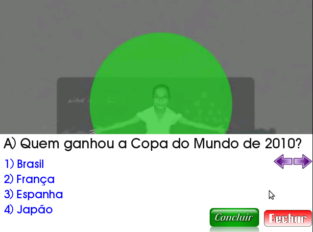

TVD Quiz
--------
O TVD Quiz é uma aplicação desenvolvida em NCL e Lua para o Sistema Brasileiro de TV Digital, que permite que o usuário/telespectador responda a um Quiz a partir da tela da sua TV.

As perguntas e alternativas são cadastradas em um arquivo lua de dados, permitindo a fácil inclusão e alteração de perguntas, assim como de alternativas.

Autores
-------

- Ueslei Taivan (Faculdade Católica do Tocantins)
- Manoel Campos da Silva Filho (Instituto Federal de Educação do Tocantins)

Licença
-------

O projeto é licenciado sob a [Creative Commons Atribuição-NãoComercial-CompartilhaIgual 2.5 Brasil (CC BY-NC-SA 2.5 BR)](http://creativecommons.org/licenses/by-nc-sa/2.5/br/)